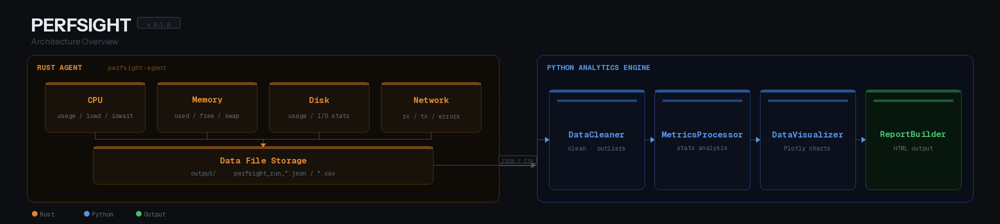

# PerfSight - 云原生压测智能分析平台

> **核心理念**: One-Command Deploy, Zero-Touch Observe
> **中文理念**: 一键部署，零触监控

[](https://opensource.org/licenses/MIT)
[](https://www.rust-lang.org/)
[](https://www.python.org/)

## 📋 项目概述

PerfSight 是一个集成了实时监控、数据分析和报告生成的云原生性能分析平台。通过现代化的技术栈，为开发者和运维团队提供从性能采集到可视化报告的全链路解决方案。

### 解决的核心痛点
- 传统监控工具配置复杂，缺乏与分析工具的联动
- 性能分析依赖人工经验，难以快速定位根因
- 监控数据与分析报告分离，缺乏一站式解决方案

## 🚀 核心功能

- **🔧 一键部署**：通过单一脚本启动 Rust Agent，快速开始性能采集
- **📊 零触监控**：Rust Agent 自动采集系统性能指标（CPU、内存、磁盘、网络、进程等）


## 🏗️ 技术架构



## 📦 技术栈

- **后端/代理**：Rust（高性能、内存安全），基于 `sysinfo` + `procfs`（Linux）
- **数据分析**：Python, Pandas, NumPy, SciPy
- **可视化**：Matplotlib, Plotly, Seaborn
- **报告生成**：Jinja2 HTML 模板 + Plotly 交互图表

## 🚀 快速开始

### 环境要求

- **Rust**: 1.70+
- **Python**: 3.8+
- **操作系统**: Linux, macOS, Windows（Linux 可采集深度 CPU 指标）

### 1. 克隆项目

```bash
git clone https://github.com/your-org/perfsight.git
cd perfsight
```

### 2. 部署 Rust Agent

```bash
cd rust-agent
# 一键部署并启动监控
./scripts/deploy.sh

# 或者手动构建
cargo build --release
./target/release/perfsight-agent start
```

#### Rust Agent 使用示例

```bash
# 生成默认配置文件
./target/release/perfsight-agent init-config

# 启动监控（5秒间隔，JSON格式，输出到 ./output）
./target/release/perfsight-agent start -i 5 -f json -o ./output

# 显示系统信息快照
./target/release/perfsight-agent info

# 运行300秒后自动停止
./target/release/perfsight-agent start -d 300
```

### 3. 安装 Python Analytics

```bash
cd python-analytics
pip install -r requirements.txt
```

### 4. 运行分析

```bash
cd python-analytics

# 生成默认配置文件
python main.py init-config

# 分析数据并生成 HTML 报告
python main.py analyze -i ../rust-agent/output -o ./reports

# 仅生成可视化图表（输入单个数据文件）
python main.py visualize -i ../rust-agent/output/data.json -o ./charts
```

## 📊 使用流程

1. **部署**：运行 `deploy.sh` 或手动 `cargo build` 后启动 Rust Agent
2. **采集**：Agent 按配置间隔采集指标，输出 JSON/CSV 到指定目录
3. **分析**：Python 引擎清洗数据、计算统计指标
4. **报告**：自动生成包含 Plotly 交互图表的 HTML 报告

## 📁 项目结构

```
PerfSight/
├── README.md                    # 项目说明文档
├── LICENSE                      # 开源协议
├── .gitignore                   # Git 忽略文件
├── rust-agent/                  # Rust 监控代理
│   ├── Cargo.toml              # Rust 项目配置
│   ├── config.toml             # Agent 运行配置
│   ├── README.md               # Agent 说明
│   ├── src/                    # 源代码
│   │   ├── main.rs             # CLI 入口（start / init-config / info）
│   │   ├── collector/          # 指标采集模块
│   │   │   ├── cpu.rs          # CPU 基础指标
│   │   │   ├── deep_cpu.rs     # Linux 深度 CPU 指标（procfs）
│   │   │   ├── memory.rs       # 内存指标
│   │   │   ├── disk.rs         # 磁盘指标
│   │   │   ├── network.rs      # 网络指标
│   │   │   └── process.rs      # 进程指标（可选）
│   │   ├── exporter/           # 数据导出（JSON/CSV）
│   │   └── config/             # 配置管理
│   └── scripts/
│       └── deploy.sh           # 一键部署脚本
├── python-analytics/            # Python 分析引擎
│   ├── requirements.txt        # Python 依赖
│   ├── config.yaml             # 分析引擎配置
│   ├── main.py                 # CLI 入口（analyze / visualize / init-config）
│   ├── data_processor/         # 数据处理模块
│   │   ├── cleaner.py          # 数据清洗
│   │   ├── metrics_processor.py # 指标统计分析
│   │   └── visualizer.py       # Plotly 图表生成
│   ├── ai_diagnosis/           # AI 诊断模块（开发中）
│   ├── report_generator/       # 报告生成器
│   │   └── report_builder.py   # HTML 报告构建器
│   ├── templates/
│   │   └── report_template.html # HTML 报告模板
│   └── config/
│       └── settings.py         # 配置数据类定义
├── database-monitor/            # 数据库监控模块（可选）
│   └── pg_monitor.py           # PostgreSQL 监控脚本
└── examples/                    # 使用示例
    └── demo_scripts/
        └── quick_start.sh      # 快速启动脚本
```

## 🔧 配置说明

### Rust Agent 配置

`config.toml`（可通过 `init-config` 命令生成）：

```toml
[monitoring]
enable_cpu = true
enable_memory = true
enable_disk = true
enable_network = true
enable_processes = false      # 默认关闭，开启后采集进程列表
cpu_interval_ms = 1000
disk_mount_points = ["/"]     # 挂载点，macOS 示例为 "Macintosh HD"
network_interfaces = []       # 为空则采集所有接口

[export]
retention_days = 7
compress_old_data = true
file_prefix = "perfsight"
include_timestamp = true
```

### Python Analytics 配置

`config.yaml`（可通过 `python main.py init-config` 生成）：

```yaml
data_processing:
  time_column: timestamp  # 时间戳字段名
  outlier_threshold: 3.0  # Z-score 异常值过滤阈值

visualization:
  enable_cpu_chart: true
  enable_memory_chart: true
  enable_network_chart: true
  enable_disk_chart: true
  figure_size: [12, 6]
  output_dir: ./reports/charts

debug: false
```

## 📈 示例报告

生成的 HTML 报告（基于 Jinja2 + Plotly）包含：

- **📊 数据概览**：总记录数、监控时长、指标类型统计
- **⚡ 性能指标分析**：CPU、内存、磁盘、网络使用情况
- **📈 数据可视化**：Plotly 交互式时间序列图和分布图


## 🔍 监控指标

### 系统指标（全平台）
- **CPU**: 使用率、负载平均值
- **内存**: 使用率、可用内存、Swap 使用情况
- **磁盘**: 使用率、可用空间、I/O 统计
- **网络**: 接收/发送字节数、数据包统计、错误率

### Linux 深度 CPU 指标
- 通过 `procfs` 采集：上下文切换次数、CPU 调度延迟等内核级指标

### 进程指标（可选，默认关闭）
- **进程列表**: CPU/内存占用最高的进程
- **进程状态**: 运行状态、父进程关系

## 🚀 部署选项

### 本地部署

```bash
# 克隆项目
git clone https://github.com/your-org/perfsight.git
cd perfsight

# 部署 Rust Agent
cd rust-agent && ./scripts/deploy.sh

# 安装 Python 依赖
cd ../python-analytics && pip install -r requirements.txt
```

### Docker 部署（计划中）

```bash
# 构建镜像
docker build -t perfsight .

# 运行容器
docker run -d --name perfsight -v /data:/app/data perfsight
```

## 🤝 贡献指南

我们欢迎社区贡献！

### 开发环境设置

```bash
# 克隆项目
git clone https://github.com/your-org/perfsight.git
cd perfsight

# 构建 Rust Agent
cd rust-agent && cargo build

# 安装 Python 依赖
cd ../python-analytics && pip install -r requirements.txt

# 运行测试
cargo test
python -m pytest
```

## 📄 许可证

本项目采用 MIT 许可证 - 查看 [LICENSE](LICENSE) 文件了解详情。

---

⭐ 如果这个项目对您有帮助，请给我们一个 Star！